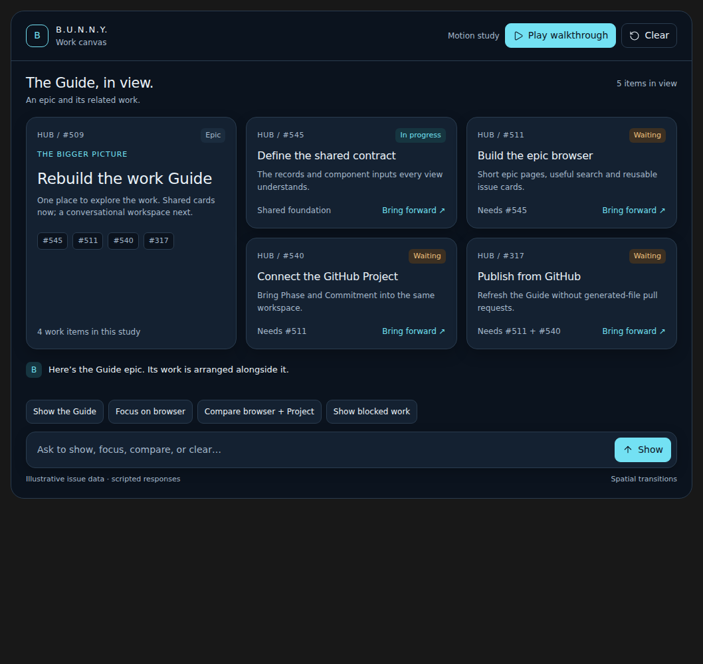
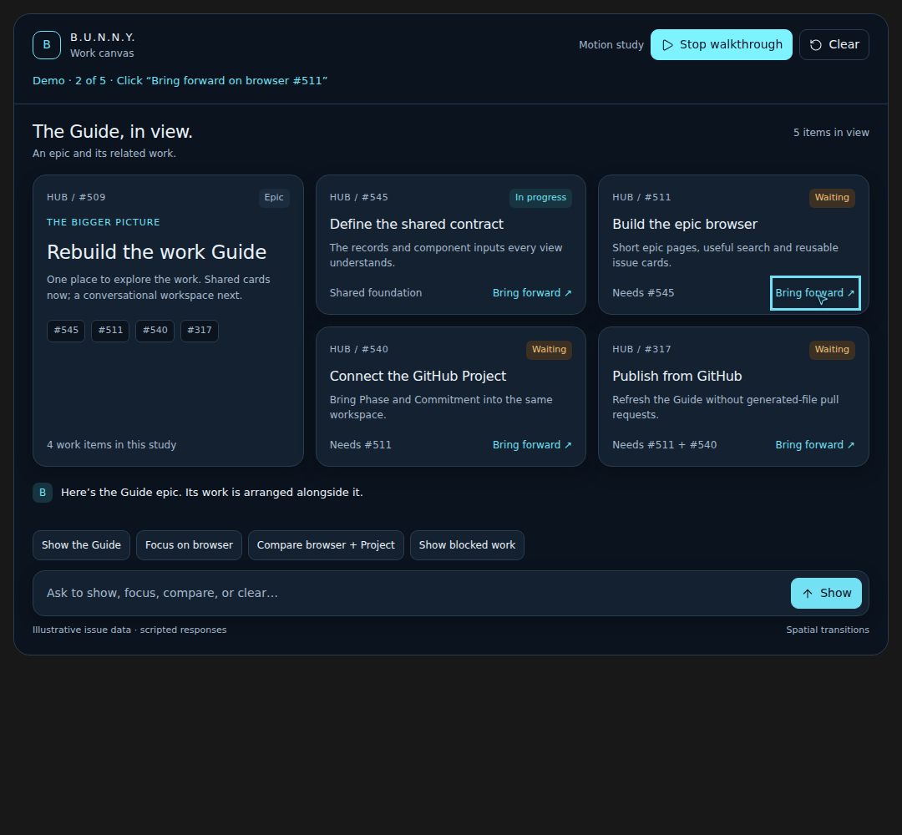

# Jev work canvas: design reference

This is the scripted motion study discussed with the owner on September 30,
2026. It preserves the intended interaction: request work and bring reusable
issue cards and epic groups onto the screen, then rearrange them without losing
context. [The Guide epic](https://github.com/jimmie-potts/agent-device-hub/issues/509)
owns the delivery scope; [the motion story](https://github.com/jimmie-potts/agent-device-hub/issues/515)
owns the later implementation. This reference does not change their release gates.

## Open the demo

Open [jev-work-canvas-preview.html](jev-work-canvas-preview.html) in a modern
browser from a local checkout or download. GitHub's file page displays source,
not a running demo. The preview includes its sandboxed frame and does not need
the Codex app or a running Hub. It loads pinned Lucide and Floating UI scripts
from `unpkg.com`; allow that network access for the original icons and controls.
There is no GitHub collector, model request or device operation.

Select **Play walkthrough** to see five actions: show the Guide, bring the
browser issue forward, compare browser and Project, show blocked work, and
return to the Guide. You can also use the buttons or type the supported
requests. Typing and clicking take over from the automated walkthrough; **Clear**
returns to the empty canvas.

## What the study demonstrates

- An epic groups reusable issue cards. A card keeps its identity while moving
  between overview, focused, comparison and blocked-work views.
- Bringing one issue forward leaves its epic and related work visible.
- Motion communicates what appeared or moved, then settles for reading.
- Narrow screens stack the same content. Reduced motion retains the information,
  controls, target highlights and walkthrough labels without spatial animation.
- The walkthrough moves a visible pointer to the actual control, highlights it,
  shows a click pulse and pauses around the resulting change. User input cancels
  pending demo actions. The repository's preview rule lives in `AGENTS.md`.

## Limits and provenance

Issue numbers, statuses, relationships and responses are illustrative fixtures
from the study, not a maintained backlog snapshot. For example, its publication
card predates the distinction between fatal inventory failures and optional
enrichment gaps. Follow the live issues and accepted contracts for current
behavior. Do not refresh this artifact to track routine issue changes.

The text box selects scripted scenarios; it does not demonstrate model
understanding. The empty initial canvas, Clear behavior, arrangement and timings
are design examples, not the production browser's default or a contract. The
ordinary Guide must remain complete and usable without inference. This study
does not implement pinning, undo, persistent conversation, live data or the
production shared component package.

The two HTML files and screenshots are byte-for-byte copies of the September 30
artifact. `jev-work-canvas.html` is the authored inline fragment;
`jev-work-canvas-preview.html` contains the standalone wrapper and a copy of that
fragment. Keep these as a frozen reference rather than independently editing the
two copies. The optional Codex state bridge in the fragment does not establish
production persistence. Source and browser validation for preservation are
recorded in the delivery PR; preserving the demo does not qualify live Jev.
